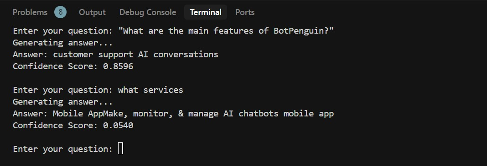
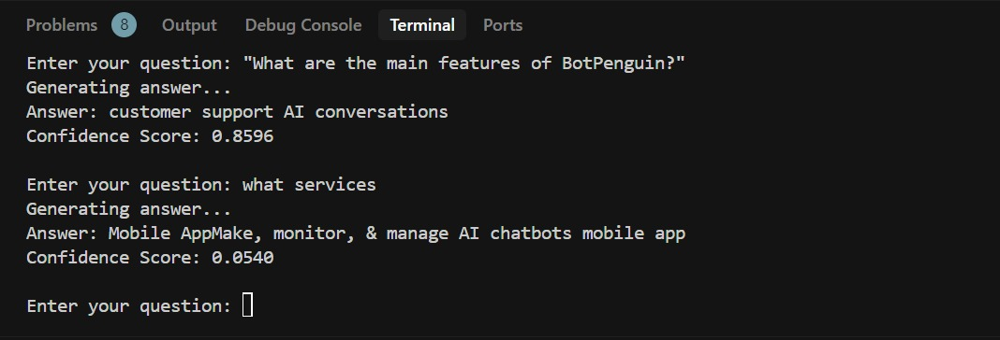

# Chatbot with Web Scraping and Hugging Face API

## Overview

This project involves creating a chatbot that interacts with a given website .

## Screenshots




## Project Structure

- **`web_scrape.py`**: Contains functions for web scraping, extracting website content, and storing it in a pickled file (`data.pkl`). It utilizes the BeautifulSoup library for parsing HTML.
- **`model.py`**: Implements the chatbot functionality using the Hugging Face API. It loads context and label from `data.pkl` and utilizes the question-answering pipeline from the transformers library.
- **`api.py`**: Demonstrates interaction with the Hugging Face API by sending a predefined question and context.
- **`check_data.py`**: Checks and prints information from `data.pkl`, ensuring that the loaded data structure is as expected.

## Setup

1. Install required packages listed in `requirements.txt`:

    ```bash
    pip install -r requirements.txt
    ```

2. Configure environment variables:

- Create a `.env` file with your Hugging Face API key:

     ```
     HUGGINGFACE_API_KEY=your_api_key_here
     ```

## Usage

1. Run `web_scrape.py` to scrape the content of a specified website (e.g., https://botpenguin.com/) and store it in [data.pkl](http://_vscodecontentref_/0). Optionally, Use [check_data.py](http://_vscodecontentref_/1) to verify the content and structure of the stored data in [data.pkl](http://_vscodecontentref_/2).

2. Run [api.py](http://_vscodecontentref_/3) to interact directly with the Hugging Face API, providing a custom question and context.

3. Run [model.py](http://_vscodecontentref_/4) to interact with the Hugging Face API using the extracted data. The chatbot answers predefined questions about the website.


